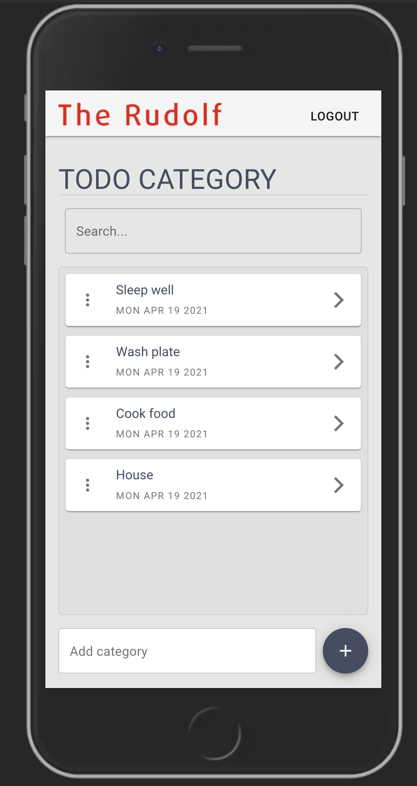
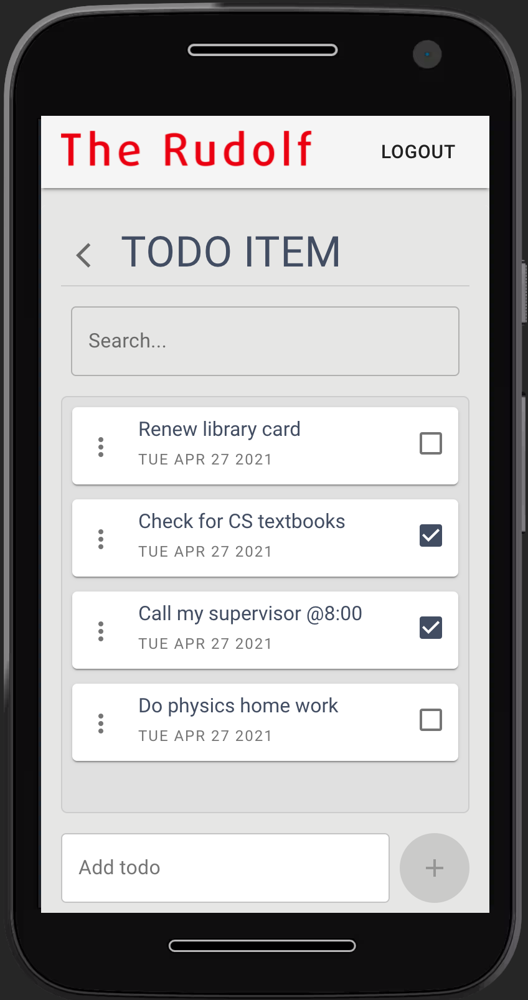

# Todo App

A Todo app developed with [Mongodb](https://www.mongodb.com/), [Express](https://expressjs.com/), [React](https://reactjs.org/)  and [Node](https://nodejs.org/en/) **(MERN)** Stack. The app runs on `http://localhost:80`.  

*****

**Note: Before you follow the setup instructions, be sure you have [Docker](https://www.docker.com/) and [Docker Compose](https://docs.docker.com/compose/) installed and running in your environment.**  
 
## SETUP INSTRUCTION
To run the app,
1. Clone the repository `git clone https://gitlab.com/prosperevergreen/todo-app`
2. Move into the folder with the command `cd todo-app`
3. In the the root directory (todo-app), start the app with the command `docker-compose up -d` you can now view the app on a browser at `http://localhost:80`
4. In the the root directory (todo-app), to stop the app use the command `docker-compose down`

Default credentials of the pre-populated users can be found [HERE](./server/database/defaultData.js)  
For further documentation of the client see the [Client README.md](client/README.md)  
For further documentation of the server see the [Server README.md](server/README.md)  

******

## iOS SCREENSHOT

  

*****

## ANDROID SCREENSHOT

*****

## DESKTOP SCREENSHOT

