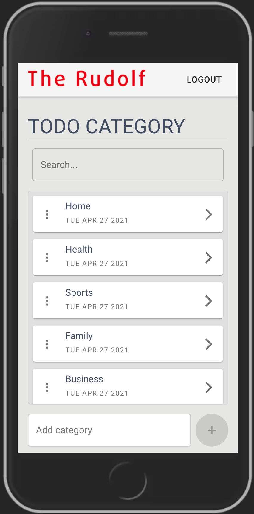
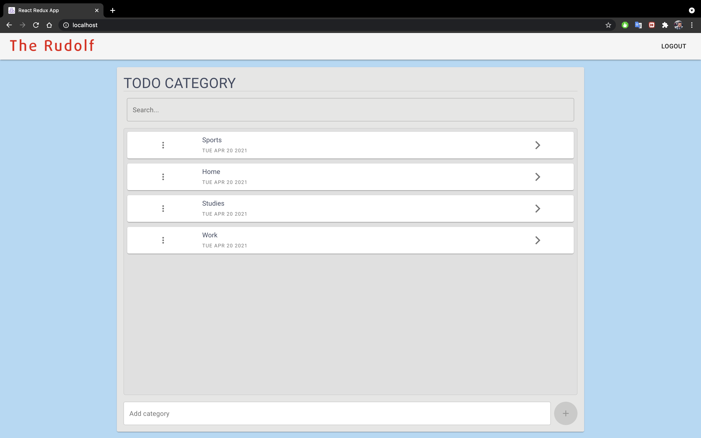

# Todo App

A simple todo app made with **mongo + express.js + react.js  + node.js (MERN) Stack**. The app runs on `http://localhost:80`.  

*****
 
## SETUP INSTRUCTION
To start the appm follow the following instruction 
1. Clone the repository `git clone https://gitlab.com/prosperevergreen/todo-app`
2. Move into the folder with the command `cd todo-app`
3. In the the root directory (todo-app), start the app with the command `docker-compose up -d` 
you can now view the app on a browser at http://localhost:80
4. In the the root directory (todo-app) to stop the app use the command `docker-compose down`

For further documentation of the server see the [Server README.md](server/README.md)  
Default credentials to pre-populated users can be found [here](./database/defaultData.js)  

******

## iOS SCREENSHOT

  

*****

## ANDROID SCREENSHOT

*****

## DESKTOP SCREENSHOT

